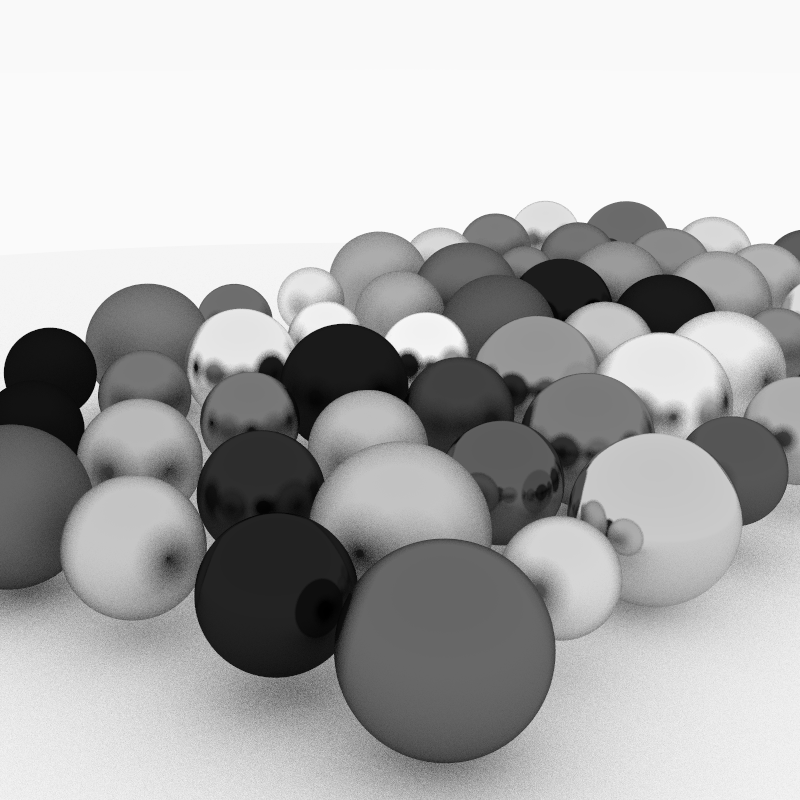

# MikTracer

A CPU-based raytracer written in C++17.



## Features

- **Materials:** Lambertian (diffuse), Metal (with configurable fuzz), Dielectric (glass with refraction)
- **Anti-aliasing:** Multisampling per pixel
- **Depth of field:** Configurable defocus blur
- **Gamma correction**
- **Configurable camera:** FOV, aspect ratio, look-at positioning

## Build & Run

```bash
make            # build
./miktracer     # render to image.ppm
make render     # build, render, and convert to renders/image.png
make clean      # remove binary and image.ppm
```

## Acknowledgements

Based on [Ray Tracing in One Weekend](https://raytracing.github.io) by Peter Shirley.
