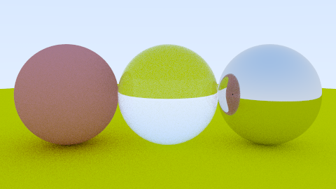

# MikTracer

A path tracing engine initially based on the core concepts from Peter Shirley's [Raytracing in One Weekend](https://raytracing.github.io/books/RayTracingInOneWeekend.html). The engine is currently built for CPU architectures, featuring ray-object intersections, progressive sampling, depth of field, physically based materials (Dielectric, Metal, Lambertian), and a modular scene composition system.

The long-term goal for this project is an engine focused around **performance**:

- **Procedural Design:** Designing a system to build data-driven, algorithmically generated environments for faster scene iteration.
- **Parallel Compute:** Implementing advanced parallel computing techniques to maximize engine performance and rendering speed.



## Development Roadmap

* **Phase 1 (Current):** Profiling, Data-Oriented Restructuring (SoA), and Bounding Volume Hierarchies (BVH).
* **Phase 2:** CPU Parallelism via SIMD Vectorization and OpenMP.
* **Phase 3:** GPU Architecture Migration (CUDA/Metal/WebGPU) and Memory Optimization.
* **Phase 4:** Advanced Monte Carlo Methods and Final Benchmarking.

## Requirements

- C++17 compatible compiler (GCC 9+, Clang 10+, MSVC 2019+)
- CMake 3.15+

## Quick render

```bash
./render.sh blue            # build + render
./render.sh blue --open     # also opens the PNG
```

`render.sh` configures CMake on first run, builds only the requested scene target, runs it, and writes the PNG to `renders/<scene>.png`.

## Core Architecture

- **Scene** (Scene.h): A pure data container (struct) holding the ObjectList. It has no knowledge of the camera or the rendering process.

- **Camera** (Camera.h): Manages view geometry and ray generation. It is stateless regarding the final image buffer.

- **Renderer** (Renderer.h): The "engine." It takes a Scene and Camera as inputs and executes the path-tracing algorithm.

- **Materials & Objects** : Extensible interfaces (Material.h, Object.h) for adding new optics (e.g., Dielectrics) or geometries (e.g., Triangles).

`SceneRunner.h` provides the high-level `runScene()` function, managing the ImageBuffer and file I/O to keep individual scene files concise.

## Parameters
### Camera
Defined in the `CameraSettings` struct:

|Parameter  |Description                                      |Default|
|-----------|-------------------------------------------------|-----------------|
|lookFrom   |World-space position of the camera.              |Vec3(0, 0, 0)    |
|lookAt     |The point the camera is focused on.              |Vec3(0, 0, -1)   |
|verticalFOV|Vertical field of view in degrees.               |20.0 – 90.0      |
|aspectRatio|Width / Height (usually 16:9).                   |1.777            |
|imageWidth |Horizontal resolution in pixels.                 |1200             |
|aperture   |Lens diameter for Depth of Field (0.0 for sharp).|0.1              |
|focusDist  |Distance to the plane of perfect focus.          |10.0             |

## Render Settings

Passed as initialiser to `runScene()`

|Parameter  |Description                                      |Default |
|-----------|-------------------------------------------------|--------------|
|samplesPerPixel|Number of anti-aliasing rays per pixel. Higher = less noise.|100 – 1000    |
|maxDepth   |Maximum number of light bounces per ray.         |50            |


## Adding a new scene

1. Create `scenes/my_scene.cpp` (see `scenes/` directory for templates)
2. Define `buildScene(Scene& scene) and buildCamera()
3. Add the target to `scenes/CMakeLists.txt`:

    ```cmake
    add_miktracer_scene(my_scene)
    ```

4. Run `./render.sh my_scene`

*Note: For high-resolution renders, increase `imageWidth` (e.g. `1920` or `3840`) and `samplesPerPixel` (e.g. `200`–`1000`). Render time scales linearly in both.*

## Manual Build

```bash
cmake -B build -DBUILD_TESTING=ON   # configure (Catch2 is fetched on demand)
cmake --build build                 # build all scenes + tests
./build/scenes/three_spheres        # run a scene
(cd build && ctest --output-on-failure)
```

## License

This project is licensed under the MIT License. See the LICENSE file for details.

## Third-party

- `include/third_party/stb_image_write.h` — vendored from [nothings/stb](https://github.com/nothings/stb), public domain. Used for PNG output.
- [Catch2](https://github.com/catchorg/Catch2) — fetched at configure time when `-DBUILD_TESTING=ON`.